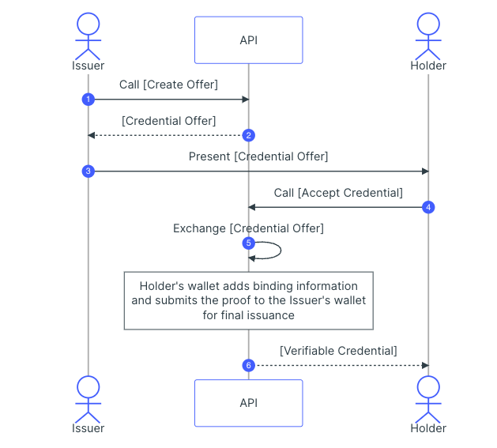

 

    

 

VerifiedEntity
---

Verified company reviews using verified Web5 DID secure channels and DWN nodes.

### Inspiration

Online partners and potential clients are constantly looking for ways to get in contact with a business or make themselves known. VerifiedEntity addresses this need by enabling businesses to create their own secure contact pages, facilitating interactions via smart contracts managed through the VerifiedEntity app. Furthermore, VerifiedEntity enhances security by assigning Decentralized Identifiers (DIDs) and VCs to verified partners.

Accounts have an additional layer of security through VerifiedEntity-issued DIDs and VCs for each verified partner on the app.

VerifiedEntity serves as a bridge for secure B2B communication, ensuring that both parties can be confident they are contacting an authorized source. This assurance is achieved through VerifiedEntity-issued credentials and decentralized identifiers. 

## How it works

VerifiedEntity has an issuer that validates and provisions DID's on behalf of businesses.

1. Pages on VerifiedEntity are automatically generated from user or company's existing web profile using <a href="https://www.lens.xyz/" target="_blank">Lens</a>.
2. Users can claim profiles using validated DIDs provisioned from the issuer address specified in the environment. This is secured via presentation exchange.
3. Validation state is saved on DWN nodes via the TBD sdk.
4. Once verified, verified pages can be shared and reviewed against by public website users.
5. Reviews are saved using DWN nodes via TBD sdk.

Rough flow is above. Taken from: https://docs.trinsic.id/guide/issuance/#interactive-issuance

## Running the project (from scratch)

1. Specify an admin DID

2. Copy `.env.sample` -> `.env`

3. Define the the fields to your desired management and paymaster contract address from (1) in `.env`.

4. `yarn; yarn dev`. The app should now be running on port 3000.

5. Go to `localhost:3000/admin`. Connect your wallet using the same address from step 3.

6. Update the `issuer` credential found in `issuer.js`

7. Provision keys for handles using this page.

Any repeated starts can be done with `yarn dev` once all variables set.

## Technologies used

VerifiedEntity pulls information from LENS to create a verified profile page for the business with contact information using TBD, Trinsic, and LENS. 

1. VerifiedEntity app has an admin issuer/verifier account that is run server side and used to validate new business page creations.
2. These server verifies all new page requests and generates unique DID and VC/VP keys that are saveable by each page owner.

* TBD: Used for DWN storage of reviews.
* Trinsic used for VC/VP exchange.

 
Note this project is a hackathon prototype and would require additional work to be production ready.

## Challenges we ran into:

Verifiable Credential Issuance: It's critical that only legitimate businesses and individuals can register under a verified handle - this prompted creating a separate admin/issuer portal and due dilligence process managed with Onyx server side in order to prevent illegal claiming of profiles. The issued handle is embedded in the VC metadata and is cross checked and time of account claiming.

User Authentication/Verification: Implementing secure user authentication processes, especially for admin functions, required a high level of attention to detail to prevent unauthorized access.

Hackathon Time Constraints: As a prototype developed for a hackathon, there were time constraints that limited the depth of development and testing. This posed challenges in ensuring the platform's robustness.

## Accomplishments that we're proud of:

## What we learned:

### Screenshots

## Potential future work

* Enhanced Security Measures: Implement advanced security features, such as multi-factor authentication and additional encryption layers, to fortify user data and interactions.
* Integration with more identity and blockchain sources: Extend compatibility to multiple blockchains to provide users with options and flexibility when conducting verified transactions.
* Community Governance: Establish a governance model that empowers platform users to influence decision-making and ensure long-term sustainability between parties on the app.
* Incentives for use and reporting: Make it easy as possible to start generating leads on the application and tracking the performance of using a VerifiedEntity page vs. traditional checks/fiat payments and public aggregator sites like Yellowpages.

### Useful links

* https://difhackathon.devpost.com/
* https://difhackathon.devpost.com/resources
* https://developer.tbd.website/api/web5-js/
* DID validator: https://didlint.ownyourdata.eu/